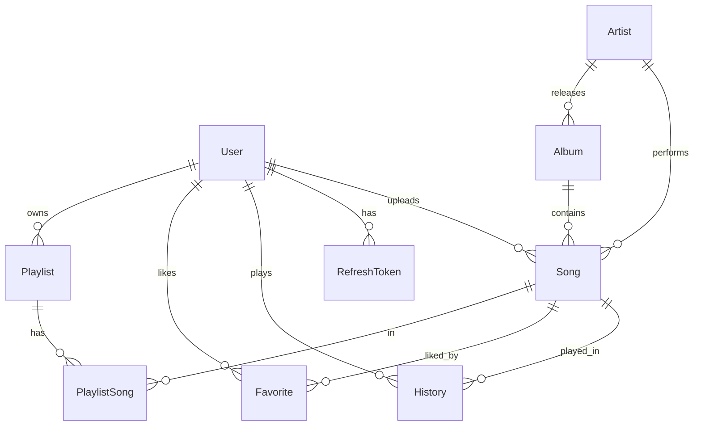

# SoundWave — Architecture

## High level

```
┌─────────────────────────┐        ┌──────────────────────────┐
│  Next.js 15 (frontend)  │  HTTP  │   NestJS API (backend)   │
│  - App Router shell     │ ─────▶ │  - 14 feature modules    │
│  - Zustand player store │ /api/* │  - JWT (access+refresh)  │
│  - TanStack Query       │ /media │  - Prisma ORM            │
└─────────────────────────┘        └────────────┬─────────────┘
                                                 │
                              ┌──────────────────┼───────────────────┐
                              ▼                  ▼                   ▼
                        PostgreSQL          Filesystem / S3      ffmpeg + yt-dlp
                        (metadata)          (audio, covers)      (transcode, import)
```

The DB stores **paths only**. Audio is streamed from `GET /api/songs/:id/stream`
with HTTP Range support (seek + progressive load). The frontend proxies `/api/*`
and `/media/*` to the API via `next.config.ts` rewrites.

## Backend modules (`backend/src`)

| Module | Responsibility |
|--------|----------------|
| `auth` | register / login / refresh / logout, JWT strategy, refresh-token rotation |
| `users` | profile read/update |
| `artists` | list + detail (albums, top songs) |
| `albums` | list + detail (tracklist) |
| `songs` | list (trending/latest/top), detail, delete |
| `streaming` | `/songs/:id/stream` Range requests, play counting |
| `playlists` | CRUD, add/remove song, drag-reorder |
| `favorites` | like/unlike, liked list |
| `history` | record + recent plays |
| `search` | instant multi-entity search |
| `upload` | MP3/WAV/FLAC → MP3 (ffmpeg) |
| `youtube` | URL validate → metadata → download → MP3 (yt-dlp + ffmpeg) |
| `dashboard` | admin stats + plays timeline + top songs |
| `admin` | manage users / songs (role-guarded) |
| shared: `prisma`, `storage`, `media` (ffmpeg/yt-dlp + ingest) | |

## Data model



## Frontend structure (`frontend/src`)

| Path | Role |
|------|------|
| `styles/` | design CSS ported verbatim (`tokens`, `components`, `app`, `landing`, `styles`) |
| `app/(app)/layout.tsx` | the SoundWave app shell (sidebar · topbar · main · activity · player) |
| `components/shell/` | Sidebar, Topbar, ActivityPanel, Player, MobileTabs, Scrim, ThemeToggle |
| `components/AudioEngine.tsx` | binds the singleton `<audio>` to the player store |
| `stores/` | `player` (persistent playback), `auth`, `ui` (theme + drawers) |
| `hooks/useCatalog.ts` | TanStack Query hooks (songs, artists, albums) |
| `lib/api.ts` | fetch wrapper with transparent 401 → refresh |

## Streaming flow

1. UI calls `playSong(song, queue)` → sets `<audio>.src = /api/songs/:id/stream`.
2. Browser issues `Range: bytes=0-` → API replies `206 Partial Content`.
3. Seeking re-requests a new byte range; the API serves it instantly.
4. First non-ranged hit increments `song.plays`.

## Upload flow

`POST /api/upload (multipart)` → validate mime → read tags (`music-metadata`)
→ `ffmpeg -codec:a libmp3lame -b:a 192k` → store under `music/` → create `Song`.

## YouTube import flow

`POST /api/youtube/preview` validates the URL and returns title/thumbnail/duration.
`POST /api/youtube/import` runs `yt-dlp -x --audio-format mp3`, stores the result,
resolves/creates the `Artist`, and creates the `Song` (`source = YOUTUBE`).
